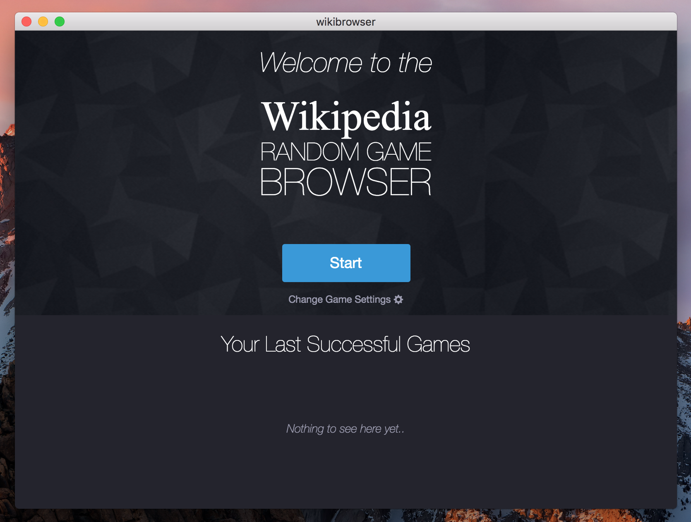

# WikiBrowser

Play the [Wikipedia Random Game](https://en.wikipedia.org/wiki/Wikipedia:Wiki_Game) (aka Wikipedia Race) with this simple app written in [NodeJS](https://nodejs.org) with the [Electron Framework](https://electron.atom.io).

**Download the latest release for MacOS, Windows or Linux [here](https://github.com/lesander/wikibrowser/releases/latest).**

*This application is a work in progress. For issues or feature requests please head over to the [GitHub issue tracker](https://github.com/lesander/wikibrowser/issues) or [create a pull request](https://github.com/lesander/wikibrowser/compare).*

---

## Roadmap
- [x] Port NW.js app to Electron app.
- [ ] Add timer game mode.
- [ ] Remove links to countries and year summaries.
- [x] Add target page setting.
- [ ] Add game mode selection menu.
- [ ] Add Ctrl+F search method `win.webContents.findInPage(query)`
- [ ] Improve local leaderboards.
- [ ] Add installer for Windows releases.
- [ ] Add auto-update feature.
